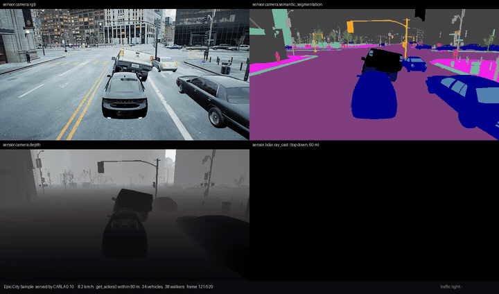

# City Sample → CARLA

Run Epic's **City Sample** as a **CARLA** simulator: real city geometry, real
CARLA traffic, real CARLA sensors.



*Four synchronised CARLA sensors on Epic's City Sample: RGB, semantic
segmentation, depth, and a top-down LiDAR sweep. Every panel is a thing that
returned nothing at all before the fixes in this repository. Recorded with
`python tools/record_carla.py --gif` — the full 26-second clip is
[docs/citysample-carla.mp4](docs/citysample-carla.mp4).*

There are two halves, and you can stop after the first:

| | what you get | what it costs |
|---|---|---|
| **A. Road network** | The city's roads as an ASAM **OpenDRIVE** `.xodr`. Drives in any CARLA. | An afternoon. Only needs UE 5.8 + City Sample. |
| **B. The whole city** | CARLA serving the City Sample level itself — buildings, props, lighting. | Also needs CARLA built from source against its UE 5.8 fork. |

**Validated on `Small_City_LVL`:** 3,337 roads · 172 junctions · 145 km ·
2,861 spawn points · 52-53 of 54 vehicles driving at a median 30 km/h.

Background: [carla#9852](https://github.com/carla-simulator/carla/issues/9852).

> ### ⚠ Read this before collecting any data
>
> **Working** — cameras, depth, GNSS, IMU, collision sensors, vehicle control,
> **LiDAR, radar, `ground_projection`, `cast_ray`**, **353 traffic lights**
> across 106 junctions and **229 stop signs** across the other 66, **1,096
> crosswalks**, **camera semantic segmentation** (0.5 % unlabeled), **semantic
> LiDAR** (3.3 % unlabeled), **pedestrian navigation**, and **Epic's own
> traffic and crowd** mirrored into `world.get_actors()`.
>
> Three of those are **opt-in**, because each one changes what the server does:
>
> | flag | what it turns on | step |
> |---|---|---|
> | `-ExecCmds "carla.FastGeoTagger.Enable 1"` | camera semantic labels for the city geometry | §3.10 |
> | `-ExecCmds "carla.MassBridge.Enable 1"` | Epic's traffic *and crowd* visible to `world.get_actors()` | §3.9 |
> | a built navmesh in `Content\Map\Nav\` | walkers and `get_random_location_from_navigation()` | §3.11 |
>
> **Known gaps, measured on the running server (§11):**
>
> - **Semantic LiDAR is still unlabeled.** The FastGeo tagger fixes the
>   *camera*, which reads labels from custom primitive data. Semantic LiDAR
>   takes its tag from the physics hit's component instead — a different code
>   path that also cannot see FastGeo primitives. It returns mostly tag 0.
> - **Road signs are absent.** Stop, yield and speed-limit sign objects are not
>   emitted into the OpenDRIVE. Traffic lights are.
> - **Sidewalks are synthesised, not measured.** The exported road network has
>   no sidewalk lanes, so pedestrian navigation runs on 2.5 m strips laid along
>   the carriageway edges. They approximate where the real sidewalks are (§3.11).
> - **The Mass bridge is read-only** and must not be run alongside CARLA's
>   Traffic Manager. It mirrors the entities **nearest the spectator**, capped
>   by `carla.MassBridge.MaxProxies` (150 vehicles) and
>   `carla.MassBridge.MaxWalkers` (100) — so it shows you the traffic you can
>   see, not a sample of the whole city, but it is a window, not a census.
>
> Good for control, planning, navigation, signalised junctions, pedestrians and
> LiDAR/radar work. For semantic segmentation, use the camera, not the LiDAR.

---

## 1. What you need

| | for A | for B |
|---|:--:|:--:|
| **Unreal Engine 5.8** (Epic Games Launcher) | ● | |
| **The City Sample** (free on Fab → add to library → create project) | ● | ● |
| **Visual Studio 2022** with the **C++ x64 toolset** and the **.NET Framework 4.8 SDK** | ● | ● |
| **Python 3.10+** | ● | ● |
| **CARLA** (`pip install carla`) — for testing the `.xodr` only | ● | |
| **CARLA built from source**, `ue58-dev-carla` @ `de3f38e64`, against the **CARLA fork of UE 5.8** | | ● |
| An **Epic-linked GitHub account** (`CarlaUnreal/UnrealEngine` is private) | | ● |
| ~**385 GB** free disk, ~**64 GB** RAM | | ● |

Check your machine:

```bash
python tools/doctor.py
```

It checks the part B prerequisites — toolchain, GPU, and the ~385 GB the engine
build needs. `python tools/doctor.py --part-a` checks only what part A needs,
which is far less.

---

## 2. Part A — extract the road network

### Step 1 — build the export plugin (once)

Copy `CityRoadExport/` into your City Sample project's `Plugins/`, then:

```bash
"C:\Program Files\Epic Games\UE_5.8\Engine\Build\BatchFiles\Build.bat" CitySampleEditor Win64 DebugGame -Project="<path>\CitySample.uproject"
```

### Step 2 — export the ZoneGraph

```bash
"C:\Program Files\Epic Games\UE_5.8\Engine\Binaries\Win64\UnrealEditor-Win64-DebugGame-Cmd.exe" "<path>\CitySample.uproject" -run=ExportZoneGraph -Map=/Game/Map/Small_City_LVL -Out="C:\full\path\to\this\repo\zonegraph.json" -unattended -nosound -nullrhi
```

**Give `-Out` an absolute path.** Unreal resolves relative paths against the
process working directory, which the engine sets to its own `Binaries\Win64`
folder during startup — so a bare `-Out=zonegraph.json` writes into
`C:\Program Files\...`, if it can write there at all, and step 3 then fails with
`FileNotFoundError`.

A few minutes, ~50 MB of JSON. Success looks like `Wrote ... -- N lanes` at the
end of the commandlet's output.

### Step 3 — convert to OpenDRIVE

```bash
python tools/zonegraph_to_roadnetwork.py zonegraph.json -o roadnetwork.json
python tools/roadnetwork_to_xodr.py roadnetwork.json -o SmallCity.xodr
```

### Step 4 — look at it, then drive it

```bash
python tools/plot_xodr.py SmallCity.xodr -o SmallCity.png
```

`plot_xodr.py` needs nothing running. To actually *drive* the network you need
a CARLA server on port 2000 — any released CARLA will do, you do not need
part B for this. `pip install carla`, start a stock CARLA, then:

```bash
python tools/carla_validate_xodr.py SmallCity.xodr
```

It loads your `.xodr` with `generate_opendrive_world`, spawns traffic on it and
reports whether the vehicles actually route.

---

## 3. Part B — run the City Sample as a CARLA server

You need CARLA source and its UE 5.8 engine fork built. Then, in order:

> **Tell the scripts where your things are, first.** The PowerShell scripts and
> `fetch-carla-content.sh` all default to the layout this was developed on. Set
> these three once per shell and every command below works unchanged:
>
> ```powershell
> $env:CARLA_DIR      = "C:\carla-ue58\carla"                 # CARLA source checkout
> $env:CARLA_UE_DIR   = "C:\carla-ue58\UnrealEngine5_carla"   # the CARLA fork of UE 5.8
> $env:CITYSAMPLE_DIR = "$env:USERPROFILE\Documents\Unreal Projects\CitySample"
> ```
>
> Those are also the defaults, so if your layout matches you can skip this. If
> it does not and you skip it, `Integrate-CarlaIntoCitySample.ps1` stops with
> `missing CARLA plugin: C:\carla-ue58\...`.
>
> Each script also takes them as parameters, but the names differ:
> `Integrate-*.ps1` has `-CarlaRoot -CitySample -EnginePath`, `Run-*.ps1` has
> `-CarlaRepo -CitySample -EnginePath`, `Build-*.ps1` has `-CitySample
> -EnginePath`. The environment variables work for all of them, which is why
> they are the documented route.

### Step 1 — CARLA content, without the 91% you don't need

```bash
bash tools/fetch-carla-content.sh
```

Run it from Git Bash (it is a shell script, and it uses `git`, `awk` and `sed`).
It works on `$CARLA_DIR` if set, otherwise `C:\carla-ue58\carla`.

`carla-content` tracks **513,074** git-lfs files. 468,594 of them are
`__ExternalActors__/` — World Partition data for CARLA's *own* towns, which you
are not loading. The script sparse-checks-out the **44,383 files / 46 GB** that
matter. A full clone runs at ~67 GB/hr and will fill your disk.

### Step 2 — build CARLA's C++

```bash
SetupWithBuildTools.bat --skip-content
```

Run it **from this repository**, not from your CARLA checkout — it `cd`s to
`%CARLA_ROOT%` itself, and it finds `toolsetch-carla-content.sh` beside
itself. It replaces `CarlaSetup.bat`, which cannot find VS Build Tools
(issue 1).

It picks up `CARLA_DIR` if you set it (same variable as everything else) and
otherwise assumes `C:\carla-ue58\carla`. `VCVARS` at the top of the file
assumes VS 2022 **Build Tools**; edit that line if you have the full IDE.

It also requires `CARLA_UNREAL_ENGINE_PATH` to point at your **built** CARLA
UE 5.8 fork, and exits immediately if it is unset or contains no
`UnrealEditor.exe`:

```bash
set CARLA_UNREAL_ENGINE_PATH=C:\carla-ue58\UnrealEngine5_carla
```

### Step 3 — merge CARLA into the City Sample project

```bash
powershell -File tools\Integrate-CarlaIntoCitySample.ps1
```

This moves CARLA *into* the City Sample project rather than the reverse — City
Sample is 83 GB and Unreal asset references are absolute (`/Game/...`), so
moving the small side means nothing has to be re-pathed. It copies the four
CARLA plugins, junctions in the 46 GB of CARLA content, patches the `.uproject`
and `DefaultEngine.ini`, applies `patches/carla-ue58-plugin-build-fixes.patch`,
and drops your extracted `SmallCity.xodr` into `Saved/OpenDrive/`.

Everything it edits is backed up as `*.pre-carla.bak`, and `-Undo` restores
those, removes what it copied, and deletes the installed `.xodr` and navmesh.
It does **not** reverse two things: the git patch applied to your CARLA source
tree, and the HKCU engine registration. Undo those by hand if you need a clean
slate — and note that `git reset --hard` in the CARLA checkout leaves the one
file the patch *creates* (`Carla/Util/CarlaTraceChannels.h`) behind; delete it
too, or the next integrate has to fall back to a 3-way apply.

### Step 4 — build

```bash
powershell -File tools\Build-CarlaCity.ps1
```

It builds `Development` first and retries in `DebugGame` only on an internal
compiler error. If it reports `build succeeded (DebugGame)`, pass that on to the
run script — the two configurations are different binaries:

```bash
powershell -File tools\Run-CarlaCity.ps1 -Configuration DebugGame
```

### Step 5 — run

```bash
powershell -File tools\Run-CarlaCity.ps1
```

Waits until port 2000 actually accepts a connection before returning.

> **The first run takes 1–2 hours** and looks like a hang. It is not: with a
> cold derived-data cache Unreal compiles City Sample's Nanite meshes, distance
> fields, animations and 8K Megascans textures. Watch
> `logs/run-carlacity.log` grow. **Subsequent runs take about 60 seconds.**
>
> It also writes about **75 GB of derived data** that nothing warns you about:
> 30.7 GB in the project's `DerivedDataCache`, 14.8 GB `Intermediate`,
> 14.6 GB engine DDC and 14.8 GB in the Zen cache. Budget for it.

### Step 6 — confirm it works

```bash
python tools/carla_probe.py --shots 5 --traffic 60
```

Prints the map CARLA is actually serving, saves camera frames to `shots/`, and
spawns traffic to check the network is navigable.

### Step 7 — confirm the sensors see the world

```bash
python tools/verify_sensors.py
```

Checks LiDAR, semantic LiDAR, radar, `ground_projection`, `cast_ray` and the
segmentation encoding. Deliberately *not* a `points > 0` test: with `SensorTrace`
blocking by default, a lidar bolted to a car returns tens of thousands of hits
off its own bodywork while the world still ignores the channel. The real control
is an **unparented** lidar 10 m above the road, plus a distance histogram — a
cloud collapsed into a 1–3 m shell means the fix did not take.

### Step 8 — traffic lights

The extracted network has correct geometry but no signals, so CARLA drives all
172 junctions uncontrolled. City Sample's signal layout is **not in the
ZoneGraph** — it lives in a separate data asset:

```bash
python tools/masstraffic_lights_to_json.py "<CitySample>/Content/AI/Traffic/TrafficLights/CitySampleSmallCityTrafficLights.uasset" -o lights.json
python tools/add_signals_to_xodr.py SmallCity.xodr lights.json -o SmallCity-signals.xodr
copy SmallCity-signals.xodr "<CitySample>\Saved\OpenDrive\Small_City_LVL.xodr"
```

Restart the server, then check it:

```bash
python tools/carla_traffic_lights.py --traffic 60 --watch 30
```

Both converters have `--selftest` and need no editor and no rebuild.

> **Three encodings look right and produce nothing.** Worth knowing before you
> touch this code:
>
> - `<validity fromLane="0" toLane="0"/>` — CARLA's
>   `RemoveZeroLaneValiditySignalReferences` **deletes** any signal reference
>   whose validities are all zero. Most stock towns write exactly this and get
>   away with it only because their lights are hand-placed actors that
>   `SpawnTrafficLights` adopts. A generated map has no such actors, so 0/0
>   means no lights at all. Do not copy a stock `.xodr` as a template.
> - **Omitting `<validity>`** is not the fix either — the trigger box is built
>   from the validities, so an empty set yields a light nothing can trigger.
>   Write `-N..-1` explicitly.
> - **A `<controller>` with no junction reference.** `ATrafficLightGroup` is
>   keyed by junction and cycles its controllers, so a phase *is* a controller.
>   The `<controller>` element must appear twice: once at top level listing its
>   signals, and once inside `<junction>` as a reference. Without the second,
>   `SpawnTrafficLights` logs "No junctions in controller".

### Step 9 — Epic's traffic in `world.get_actors()` (optional)

City Sample's traffic is Epic's **Mass ECS**, not Actors:
`UMassTrafficVehicleVisualizationTrait` only ever gives ~50 entities a real
`AActor` (LOD High=10, Medium=40), and *which* 50 churns every few frames. So
`world.get_actors()` returned 3 while the camera rendered hundreds of cars —
every one a silent false negative in any ground-truth label.

The `CarlaMassBridge` plugin mirrors those entities into CARLA's registry as
**dormant proxies**. CARLA already supports actorless entries — `FCarlaActor`
with `ActorState::Dormant` and a null actor, served entirely from `FActorData`
— so no faked `AActor` is involved. Enable it at launch:

```bash
powershell -File tools\Run-CarlaCity.ps1 -ExecCmds "carla.MassBridge.Enable 1"
python tools/carla_mass_bridge.py
```

Measured: **150 proxies** (the default cap), ids in the dedicated dormant range
`0x80000002–0x8000025D`, 4.8 m bounding boxes, 106 of 150 tracking live motion.

> **Three constraints, all deliberate.**
>
> - **Read-only.** Control calls on a dormant proxy do *not* fail loudly:
>   `FVehicleActor::SetActorAutopilot` has an empty dormant branch and still
>   returns `Success`, and `ApplyControlToVehicle` writes to `FActorData` that
>   the bridge overwrites next frame. Treat proxies as observations.
> - **Do not run the Traffic Manager with the bridge on.** ALSM calls
>   `world.GetActors()` every cycle and adopts any unregistered actor whose type
>   id starts with `v`, with no dormant check — it would take every proxy as an
>   unregistered vehicle and run a waypoint search per bounding-box corner.
> - **Off by default**, capped at 150 (`carla.MassBridge.MaxProxies`). Turning
>   it off deregisters every proxy rather than freezing them in the registry.

Two things this needed in CARLA itself, both in the patch: `FActorRegistry`
gained `CARLA_API` (its out-of-line members were never exported, so any other
module calling them got LNK2019), and a new `RegisterDormant()` entry point —
the registry's only door took an `AActor&`, though everything downstream of
creation already tolerated a null one.

### Step 10 — semantic labels for the city itself (optional)

City Sample streams its world through Epic's **FastGeoStreaming** plugin as
`FFastGeoPrimitiveComponent` — plain C++ objects implementing
`IPrimitiveComponent`, **not** `UPrimitiveComponent` UObjects, and not owned by
actors. CARLA's `ATagger` therefore cannot reach them at all:
`TActorIterator<AActor>` never yields them, `GetComponents<UStaticMeshComponent>()`
never returns them, and `SetStencilValue(UPrimitiveComponent&)` could not even
take one as an argument. A census inside `ATagger` measured the damage: **seven**
static mesh components in the entire city.

`CarlaFastGeoTagger` walks the FastGeo containers directly, classifies each mesh
with the same rule table, and writes the label into custom primitive data:

```bash
powershell -File tools\Run-CarlaCity.ps1 -ExecCmds "carla.FastGeoTagger.Enable 1"
python tools/verify_sensors.py
```

Measure it with:

```bash
python tools/segmentation_census.py --settle 25
```

In the steady state the sweep reports every loaded primitive already correct:

```
CarlaFastGeoTagger sweep: 81 containers, 51553 seen, 0 written,
                          51553 already, 0 unmatched, 0 awaiting render state
```

and the semantic frame goes from 98.8 % `Unlabeled` to **0.5 %**:

```
label                 before    after
3  Buildings               0  243,359
1  Roads                   0  179,899
20 Static                  0   24,908
2  Sidewalks               0   19,409
6  Poles                 319    4,314
0  Unlabeled         474,000    2,409
distinct labels             7       12
```

> **Run it twice.** The first measurement after the server starts is not
> meaningful, and it fails loudly rather than reporting a number: while the
> world is still streaming, untagged FastGeo geometry renders with whatever
> City Sample left in float 5 of its custom primitive data, and the shader
> reads *that* as a label — so untagged primitives show up as nonsense labels
> above 29, not as `Unlabeled`. The second and later runs settle at 0.5 %.

> **Five traps, all of which fail completely silently.**
>
> - **Do not cache "already tagged" against a pointer.** World Partition
>   unloads a container when the streaming source moves away and loads it again
>   when it comes back, and the allocator reuses the *same addresses* for the
>   replacements. Both a `TSet` of tagged component pointers and a `TMap` of
>   containers-by-primitive-count therefore report brand-new, untagged geometry
>   as done. One fixed viewpoint measured anywhere between 0 % and 92 %
>   `Unlabeled` depending on how streaming had cycled. The sweep keeps **no
>   state at all** and re-reads each component's own label float instead —
>   which cannot go stale, and costs a pointer chase and a compare per
>   component.
> - **`MarkRenderStateDirty(true)` crashes the server.** Forcing the flag on a
>   component whose `ProxyState` is `Creating` queues it for recreation, and the
>   recreate path re-enters `CreateRenderState`, which asserts
>   `ProxyState == None || Delayed` (`FastGeoPrimitiveComponent.cpp:331`). It is
>   a race against streaming, so it survives whole sessions and then takes the
>   server down mid-run. It is also unnecessary: `CreateRenderState` builds the
>   proxy from the component's *current* data, so a label written before the
>   proxy exists is simply picked up when it is created.
> - **`GetStaticMeshComponents()` is not the geometry.** The container fills it
>   with `CastTo<FFastGeoStaticMeshComponent>()` — the *concrete* non-instanced
>   class — so it silently excludes `FFastGeoInstancedStaticMeshComponent`,
>   which is what a modular city is built from. It returned 184 components;
>   iterating `GetPrimitiveComponents()` and casting to the shared **base**
>   returns 106,949.
> - **`DataIndex` is a float index, not a float4 index.** `ATagger` calls
>   `SetCustomPrimitiveDataVector4(4, …)`, and `SetPrimitiveData` does
>   `Memcpy(&Data[DataIndex], …)` — so the label lives in floats **4 and 5**.
>   `SegmentationSensor.usf:110` agrees, reading `CustomPrimitiveData[1].xy`
>   (float4 #1 = floats 4–7). Writing to float 16 puts the label in a slot
>   nothing samples, and every pixel comes back 0 with no other symptom.
> - **`MarkRenderStateDirty()` being a no-op before the render state exists is
>   fine, and must be left alone.** `FFastGeoPrimitiveComponent`'s override
>   forwards `bEvenIfNotCreated = false`, so a component tagged during
>   container init is never queued for recreation — which looks like a gap and
>   is not one: `CreateRenderState` builds the proxy from the component's
>   *current* data, so a label written beforehand is simply picked up when the
>   proxy appears. Forcing the flag to "fix" it is what crashes the server
>   (second bullet above). The tagger therefore does not force it, and only
>   counts the components whose render state does not exist yet.
>
> Existing custom primitive data is **preserved**: the tagger reads the current
> array (through a pointer-to-member formed in a derived class, since the field
> is `protected` with no getter), grows it if needed, and overwrites only floats
> 4 and 5 — City Sample uses the lower slots for material variation.

**Still unlabeled (0.5 %)**: thin slivers at geometry edges plus anything drawn
by a World Partition HLOD proxy rather than by the real geometry it stands in
for. HLOD proxies are merged across many source meshes, so one label would be
wrong for most of the pixels; `ATagger` skips them, and
`[CarlaTagger] bTagHLODProxies=True` in `Config/DefaultGame.ini` turns them on
with a coarse `Static` if a view is dominated by them.

Note that this only fixes the **camera**. Semantic *LiDAR* tags come from the
physics hit's component, a different code path that also cannot see FastGeo
primitives — so semantic LiDAR still returns mostly tag 0. See
[Known limitations](#11-known-limitations).

---

### Step 11 — pedestrians (optional)

Walker AI needs a Recast navmesh. CARLA builds one for
`generate_opendrive_world` but not for a level that already exists, so out of
the box the City Sample has none — and the failure is completely silent:
`get_random_location_from_navigation()` returns `None` and walkers stand still.

Build one from the same `.xodr` the traffic uses:

```bash
python tools/xodr_to_recast_obj.py SmallCity-signals.xodr -o SmallCity.obj
```

```bash
%CARLA_DIR%\Build\_deps\recastnavigation-build\RecastBuilder\RecastBuilder.exe SmallCity.obj 0.3
```

`RecastBuilder.exe` comes from CARLA's own cmake build, at the path CARLA's
`RECASTBUILDER_PATH` expects.

That writes `SmallCity.bin` next to the `.obj`;
`Integrate-CarlaIntoCitySample.ps1` installs it. Re-run it, **rebuild**, restart:

```bash
powershell -Command "Get-Process UnrealEditor* -ErrorAction SilentlyContinue | Stop-Process -Force"
powershell -File tools\Integrate-CarlaIntoCitySample.ps1
powershell -File tools\Build-CarlaCity.ps1
powershell -File tools\Run-CarlaCity.ps1
```

**Stop the server first.** Re-integrating deletes and re-copies the project's
plugin folders, and the running editor holds `UnrealEditor-Carla.dll` open —
the delete then fails halfway through and leaves the project half-integrated.

The rebuild is not optional: re-integrating replaces the project's copies of the
CARLA plugins and deletes their `Binaries`, so the editor would otherwise start
with no `Carla` module — and `-unattended` suppresses the dialog that would say
so. Then check:

```bash
python tools/carla_walkers.py --walkers 30
```

```
=== navmesh ===
  get_random_location_from_navigation: 20/20 returned a point
  spread: 1,571 x 1,095 m
=== spawning 30 walkers ===
  spawned 30/30
=== walking for 15s ===
  moved > 1 m : 30
  distance m  : min 17.8 median 21.0 max 21.0
PASS - walkers navigate the map
```

608 tiles, 6.8 MB, 25,000 polygons — 44 % sidewalk, 37 % road, 18 % crosswalk.

> **Four traps here, and every one of them is silent.**
>
> - **The navmesh goes in `Content\Map\Nav\`, not `Saved\Nav\`.** Two places in
>   CARLA look for it and they disagree: `FNavigationMesh::Load` checks
>   `Saved/Nav/` first, but the client actually fetches through
>   `get_required_files("Nav")`, which only consults `Saved/` for *generated*
>   OpenDRIVE worlds and otherwise walks the map's content folder. A `.bin` in
>   the wrong one is ignored without a word in any log.
> - **Face winding decides everything.** Recast drops any triangle whose normal
>   is outside the walkable slope, so a ribbon wound the wrong way produces a
>   navmesh with **zero tiles** and no error at all — a 40-byte `.bin` that
>   loads fine and navigates nothing. The generator computes each normal and
>   picks the winding rather than assuming one, and `--selftest` checks it.
> - **`get_random_location_from_navigation()` accepts sidewalk polygons only**
>   (`setIncludeFlags(CARLA_TYPE_SIDEWALK)`), while a walker, once placed,
>   moves on sidewalk, crosswalk and grass — its default crowd filter includes
>   `CARLA_TYPE_WALKABLE` but then excludes road. The City Sample `.xodr` is exported from ZoneGraph and has
>   3,497 driving lanes, 1,096 crosswalks and **zero sidewalk lanes**, so
>   without synthesised sidewalks the navmesh is perfectly valid and still
>   cannot place a single pedestrian.
> - **The crowd only moves when the client ticks.** Client-side walker AI runs
>   Detour *in your process*, stepped from `Simulator::NavigationTick`, which is
>   reached from `world.tick()` and `world.wait_for_tick()` and nowhere else. A
>   script that `sleep`s instead sees every walker spawn and then stand
>   perfectly still — indistinguishable from a broken navmesh.

The sidewalks are **synthesised**, not measured: a 2.5 m strip is laid along
each carriageway edge, marching outward past neighbouring lanes until it finds
clear ground (ZoneGraph exports every lane as its own road, so a fixed offset
would put sidewalks in the middle of the street). They approximate where City
Sample's real sidewalk meshes are. `--sidewalk-width` and `--no-sidewalks`
control this.

---

## 4. How it works

```
  Unreal editor                    plain Python                     CARLA
  ─────────────                    ────────────                     ─────
  CityRoadExport plugin
  -run=ExportZoneGraph
        │
        ▼
   zonegraph.json  ──►  zonegraph_to_roadnetwork.py  ──►  roadnetwork.json
   raw lanes,            lanes → roads, junctions            │
   links, tags                                               ▼
                                                  roadnetwork_to_xodr.py
                                                             │
                                                             ▼
                                                      SmallCity.xodr
                                                             │
                                    Saved/OpenDrive/Small_City_LVL.xodr
                                                             │
                                                             ▼
                                               CARLA's map for the level
```

**Why the split?** The C++ plugin only *dumps* data. All road semantics live in
Python, so you can change how the network is built without recompiling. Both
Python stages have `--selftest`.

**Where the data comes from.** `Plugins/Traffic` is Epic's *"Mass & Zone Graph
based vehicle AI traffic system"*. Its lane graph is saved into the level as
`AZoneGraphData` — 17 MB in Small City, 129 MB in Big City. Every lane carries
tags (`Vehicle`, `Pedestrian`, `Intersection`, `Crosswalk`, `Freeway`,
`Freeway Onramp`/`Offramp`) that map almost directly onto OpenDRIVE lane types
and junctions.

**Why C++ and not editor Python?** `FZoneGraphStorage` is a plain `UPROPERTY()`
USTRUCT — not `BlueprintType` — so it is invisible to Python.
`unreal.ZoneGraphStorage`, `ZoneData` and `ZoneLaneData` do not exist in the
bindings. C++ is the only way in.

**How CARLA finds the network.** `UOpenDrive::FindPathToXODRFile` checks
`Saved/OpenDrive/<MapName>.xodr` *before* the content directory, so the
extracted network drops in under the level's own name with no cooking and no
asset import. Without it `world.get_map()` fails outright with
`failed to generate map`: rendering the city and *driving* it are two separate
problems, and this is the second one.

---

## 5. Troubleshooting

| Symptom | Cause and fix |
|---|---|
| Everything renders **blinding white** | CARLA's weather adds a second sun to a level that already has lighting ("Multiple directional lights are competing..."). `carla_probe.py` puts CARLA's sun below the horizon; pass `--carla-sun` to see the bad version. |
| `world.get_map()` → **"failed to generate map"** | No `.xodr` for the level. Put yours at `Saved/OpenDrive/<MapName>.xodr`. |
| `get_world()` **times out** but versions print | The server is up but the game thread is busy compiling assets. Wait for `logs/run-carlacity.log` to go quiet. |
| Startup **access violation at 0x120** in `PreInitPostStartupScreen` | CARLA CDO constructors loading `/Game/` assets at `PostConfigInit`. Apply `patches/carla-ue58-plugin-build-fixes.patch`. |
| `Assertion failed: !AreShaderTypesInitialized()` | Something moved the `Carla` module off `PostConfigInit`. It registers global shaders and must stay there. |
| Editor sits at **0% CPU** with the splash up | Live Coding deadlocks when stdout is redirected. `Run-CarlaCity.ps1` passes `-NoLiveCoding`. |
| `Unable to instantiate module 'Carla': Definitions.def` | The four generated `.def` files are missing. `cmake --build Build --target carla-unreal-configure`, or re-run the integration script. |
| `Could not find vcvars64.bat`, or setup tries to install Visual Studio | Stock `CarlaSetup.bat` only probes Community/Professional/Enterprise. Use `SetupWithBuildTools.bat`. |
| `Result: Failed (RulesError)`, *"Could not find NetFxSDK"* | Install the **.NET Framework 4.8 SDK** VS component: `tools/Install-NetFxSdk.ps1`. |
| `fatal error C1001: Internal compiler error` | Build **`DebugGame`**. (On this machine every C1001 turned out to be a failing CPU — see section 8.) |
| Exported JSON will not parse | It is UTF-16; UE's `TJsonWriter<TCHAR>` writes wide chars. Both converters handle it. |
| Disk fills during content clone | You are cloning all 513k LFS files. Use `tools/fetch-carla-content.sh`. |

---

## 6. Citing this

[](https://doi.org/PLACEHOLDER)

`CITATION.cff` carries the metadata; GitHub renders a "Cite this repository"
button from it, and Zenodo mints a DOI per release. Replace the two
`PLACEHOLDER`s above with the DOI once the first release is archived.

---

## 7. Licensing

The **tools here are yours to use and share.** They contain no Epic content.

The **City Sample is not.** Every listing carries `Allows usage with AI: No`,
and Epic's content EULA bars flagged content as *"inputs to Generative AI
Programs"*. Extracted road networks are derived from it. So:

- **Do not redistribute** `zonegraph.json`, `roadnetwork.json` or `.xodr` files
  made from the City Sample. Share the tools; let people regenerate.
- Get written clearance from Epic before using this in published work that
  involves AI models.

---

## 8. Repository layout

```
CityRoadExport/          UE 5.8 plugin (C++)  ->  -run=ExportZoneGraph
plugins/
  CarlaMassBridge/       UE plugin (C++): the Mass -> CARLA actor bridge and
                         the FastGeo semantic tagger. Edit it HERE - the
                         integrate script copies it into the project.
SetupWithBuildTools.bat  CarlaSetup.bat replacement for VS Build Tools
config/
  CarlaTagger.DefaultGame.ini    label rules, appended to the project's ini
patches/
  carla-ue58-plugin-build-fixes.patch   19 files: makes the Carla plugin
                         compile and boot, adds the collision channels, the
                         label rules, the traffic-light manager fix and the
                         navigation fallback
tools/
  zonegraph_to_roadnetwork.py    lanes -> roads + junctions      [--selftest]
  roadnetwork_to_xodr.py         roads -> OpenDRIVE 1.4          [--selftest]
  plot_xodr.py                   render a network as a PNG
  carla_validate_xodr.py         does traffic route on it?
  masstraffic_lights_to_json.py  Epic's authored lights out of a .uasset  [--selftest]
  add_signals_to_xodr.py         -> OpenDRIVE signals, controllers and
                                 stop signs                            [--selftest]
  carla_traffic_lights.py        are the lights there, grouped, cycling?
  xodr_to_recast_obj.py          -> walkable surface for RecastBuilder [--selftest]
  carla_walkers.py               do pedestrians spawn and walk?
  carla_mass_bridge.py           is Epic's traffic visible to get_actors()?
  carla_show_city.py             drive around it interactively
  record_carla.py                record a 4-sensor video of the whole thing
                                 (--gif for a README-sized loop)
  carla_spectator.py             move the camera (fly / goto / top / follow)
  carla_probe.py                 what is CARLA serving? + screenshots + traffic
  verify_sensors.py              lidar/radar/raytracer/segmentation checks
  segmentation_census.py         how much of the frame carries a label?
  fetch-carla-content.sh         sparse carla-content checkout
  repair-content-index.sh        fixes an interrupted content checkout
  Integrate-CarlaIntoCitySample.ps1   merge CARLA into City Sample   [-Undo]
  Build-CarlaCity.ps1            build the merged editor
  Run-CarlaCity.ps1              launch it as a CARLA server
  doctor.py                      prerequisite check
  Install-NetFxSdk.ps1           fixes the NetFxSDK build blocker
  archive/                       superseded attempts, kept for the record
AGENTS.md                conventions and traps, for anyone (or anything)
                         editing this repo
CITATION.cff             citation metadata; GitHub renders a Cite button
.zenodo.json             what Zenodo records when it archives a release
ISSUES-TO-FILE.md        nine reproducible CARLA bugs found on the way
docs/
  IMPLEMENTATION-PLAN.md         the design and its evidence, stage by stage
```

Everything derived from City Sample content — `zonegraph*.json`,
`roadnetwork*.json`, `lights-*.json`, `*.xodr`, `*.obj`, `*.bin` — is
**deliberately not in this repository**. It is Epic's content once derived, and
the tools above regenerate all of it from your own install in a few minutes.
See [LICENSE](LICENSE).

### Where to edit what

The project holds **copies**, so this catches everyone once:

| to change | edit | then |
|---|---|---|
| the Mass bridge or FastGeo tagger | `plugins/CarlaMassBridge/` | re-integrate, rebuild |
| anything in CARLA's `Carla` plugin | your CARLA checkout, then regenerate `patches/` | re-integrate, rebuild |
| a Python tool | `tools/` | nothing, it runs from here |

`Run-CarlaCity.ps1` warns if the project's copy of the CARLA plugin is older
than your CARLA checkout, because a build of stale code succeeds silently.

---

## 9. How this was validated

**The road network**, in CARLA 0.9.16 from `generate_opendrive_world`:

```
topology segments : 2,861      waypoints @5m : 33,754 (12,986 in junctions)
spawn points      : 2,861      drive test    : 45.1 m in 6 s, 0.04 m off centre
traffic manager   : 41/58 alive, 41/41 moving, 28-29 km/h (limit 30)
```

Geometry continuity is machine-checked: each `paramPoly3` evaluated at its
endpoint lands on the next segment's origin to within **2.45 × 10⁻⁵ m** across
5,452 joins.

**Sensors**, after the collision-channel and segmentation fixes:

```
                        before        after
unparented LiDAR             0        232,584 points  (median 26.6 m, 98.9% beyond 5 m)
radar                        0          1,980 detections
ground_projection         None        Location(500.8, 517.9, 3.1)
cast_ray over 150 m          1              3 hits
segmentation R > 29     8.7-100%        0.00%
distinct label values    217-256             6
```

Channel resolution is logged, so a misconfigured project is obvious rather than
silent:

```
CarlaTraceChannels: 'SensorTrace'    -> GameTraceChannel9
CarlaTraceChannels: 'OverlapChannel' -> GameTraceChannel10
CarlaTagger: 40 asset-path label rules loaded (builtins on)
```

**Semantic LiDAR**, after the hit-label resolver:

```
                        before                       after
tags        {0: 230481, 14: 2019, 7: 84}   {20: 104782, 1: 74076, 2: 19095,
                                            6: 9788, 3: 8376, 0: 7594,
                                            14: 4596, 5: 3281}
Unlabeled            99.1%                        3.3%
distinct labels          3                            8
```

**Traffic lights and stop signs**, from Epic's authored signal data:

```
crosswalk lanes in the ZoneGraph  : 1,096 -> 5,480 polygon points
lights harvested from the .uasset : 358
matched onto our approach roads   : 353   (106 of 172 junctions)
traffic.traffic_light actors      : 353   (was 0)
unsignalised junctions            : 66    -> 229 stop signs
traffic.stop actors               : 217   (was 0)
OpenDRIVE landmarks               : 813   (was 0)
group sizes                       : 3 x183, 4 x160, 6 x6, solo x4
phase cycle observed              : R R G G -> R R Y Y -> R R R R -> G G R R
vehicles sampled at a red light   : 47, of which 17 stationary
```

The all-red step is a real clearance interval, not a fault - a single snapshot
of a correct junction can legitimately show every light red.

**The full city**, CARLA 0.10.0 serving `Small_City_LVL`:

```
map           : Map/Small_City_LVL
spawn points  : 2,861      road segments : 2,861
extent        : 1,662 x 1,302 m
traffic       : 59/60 spawned, 54 alive, 52-53 moving (two runs)
km/h          : median 30, max 43-51
frames        : 5/5 captured from sensor.camera.rgb
startup       : 63 s warm (first run 1-2 h, cold DDC)
```

**Semantic segmentation**, FastGeo tagger on, second measurement onward:

```
sweep steady state : 81 containers, 51,553 seen, 0 written,
                     51,553 already, 0 unmatched, 0 awaiting render state
frame (800x600)    : Buildings 50.7%  Roads 37.5%  Static 5.2%
                     Sidewalks 4.0%  Poles 0.9%  Unlabeled 0.5%
distinct labels    : 12, all within 0-29
repeatability      : 0.4% / 0.5% / 0.5% / 0.4% Unlabeled over four runs
```

**Pedestrians**, from a navmesh built out of the same `.xodr`:

```
OBJ                : 3,337 roads + 66,153 sidewalk quads + 1,060 crosswalks
navmesh            : 608 tiles, 6.8 MB, 25,000 polygons
                     44% sidewalk, 37% road, 18% crosswalk, 1% blocked
random locations   : 20/20 answered, spread 1,571 x 1,095 m
walkers            : 40/40 spawned (82 placement attempts), 40/40 moved
distance in 15 s   : median 21.0 m  (= the 1.4 m/s max speed set)
```

### Things that cost real time, if you extend this

1. **One road per lane, not per lane-group.** Grouping lanes and hanging
   left/right lanes off one centreline made each road span its neighbours'
   territory; adjacent meshes overlapped and trapped vehicles. About half of all
   spawn points were unusable. Lane-centre error went 0.22 m → 0.04 m once a
   `<laneOffset>` of half the lane width was added.
2. **Lane-level links, not just road-level.** Road `<link>` alone made things
   *worse* (34/40 despawned). OpenDRIVE also needs
   `<lane><link><successor id="-1"/>`, or CARLA cannot tell which lane
   continues into which. Survival went 6/40 → 41/58.
3. **Blinding white is a lighting bug, not a texture bug.** Two directional
   lights. Costly to chase because shadowed surfaces look perfectly fine.
4. **Two measurements beat a plausible story.** The obvious explanation for the
   unlabeled geometry was World Partition HLOD proxies, and
   `get_environment_objects` supported it (52 of 56 objects were HLOD). An ini
   flag and a one-build A/B showed it moved the label-0 count by 1 % — wrong.
   Counting what the tagger actually visits then gave the real answer in one
   line: 7 static mesh components in the whole city, because City Sample streams
   its geometry through FastGeoStreaming as non-UObject primitives. Guessing
   twice would have cost days; the census cost one 4-minute build.
5. **Never cache "already done" against a pointer, in a streaming world.**
   World Partition unloads a container when the streaming source moves away and
   loads it again when it returns, and the allocator reuses the *same
   addresses*. A `TSet` of tagged component pointers therefore reported
   brand-new, untagged geometry as finished, and one fixed viewpoint measured
   between 0 % and 92 % `Unlabeled` depending on how streaming had cycled. The
   fix was to delete the cache: re-reading each component's own label float is
   both authoritative and cheap. This is also what the "remaining 18.5 %" in an
   earlier version of this README actually was.
6. **A "belt and braces" flag took the server down.** Forcing
   `MarkRenderStateDirty(true)` to be safe queued components mid-creation for
   proxy recreation and tripped an engine assertion — a race against streaming,
   so it survived whole sessions before killing a run. It was also unnecessary:
   a proxy created later is built from the component's current data, so a label
   written beforehand is simply picked up. Defensive code needs the same
   scrutiny as the code it defends.
7. **The failure mode of a silent subsystem is another subsystem's success.**
   Walker navigation was dead for three independent reasons in a row, none of
   which logged anything: the navmesh had zero tiles (wrong face winding), then
   the spawn filter accepted only sidewalk polygons the exported network did not
   contain, then the `.bin` sat in `Saved/Nav/` while the client only looks in
   the map's content folder. Each fix revealed the next. Where a subsystem can
   fail silently, write the check *before* the feature.
8. **`git sparse-checkout set` is unsafe in Git Bash.** MSYS rewrites any
   argument that looks like an absolute POSIX path, so `'!/__ExternalActors__/'`
   silently became `'!C:/Program Files/Git/__ExternalActors__/'` and excluded
   nothing. Write `.git/info/sparse-checkout` directly.
9. **Repeated compiler ICEs and machine crashes were a failing CPU.** An Intel
   i7-14700K on microcode 0x123 (Vmin Shift Instability) produced 94 C1001s and
   20+ WHEA corrected machine-check errors, 27 of 30 from one core. A BIOS
   update to microcode 0x133 fixed it: 0 WHEA, 9302/9302 engine actions, exit 0.
   If builds fail in *different* places each time, check Event Viewer for WHEA
   before blaming the compiler.

---


## 10. Using this with Carlamayo

Carlamayo's **`CARLA0.10.0-Alpamayo`** branch already targets CARLA 0.10.0
(`CARLA_VERSION = "0.10.0"`), so there is no client-version gap to close — use
that branch, with the 0.10.0 wheel built from your own tree
(`Build/PythonAPI/dist/carla-0.10.0-*.whl`).

The reason this project started, from the Carlamayo side, was that the City
Sample had no OpenDRIVE: `world.get_map()` raised `failed to generate map`,
`get_spawn_points()` was empty, and neither the Traffic Manager nor the walkers
could run. That is fixed, and the `MAP_HAS_OPENDRIVE = False` workaround in
`0001-carlamayo-opendrive-optional.patch` is obsolete — the 0.10.0 branch does
not carry it and no longer needs it.

What Carlamayo asks of a map, and what it gets here:

| Carlamayo does | Status on this map |
|---|---|
| `world.get_map()` | 2,861 road segments |
| `get_spawn_points()` | 2,861 |
| `get_random_location_from_navigation()` for walkers | works — 608 navmesh tiles |
| `synchronous_mode` + `fixed_delta_seconds = CONTROL_DT` | fine; the recorder does the same |
| 4 cameras at 1080×1920 | works, but see the note on frame rate below |

Three settings to change:

1. **`CARLA_MAP = "Small_City_LVL"`.** This one matters more than it looks.
   `carla_interface.py` guards its reload with `if map_name not in current_map:`
   and the server reports `Map/Small_City_LVL`, so that value makes the guard
   skip `load_world` and attach to the running city. Leave it at
   `"Town10HD_Opt"` and Carlamayo will load a CARLA town **over** the City
   Sample — throwing away the thing you built.
2. **`NPC_VEHICLE_COUNT = 0`.** Carlamayo spawns NPCs with
   `SpawnActor(...).then(SetAutopilot(...))`, and autopilot decays on this map
   (issue 9): vehicles are destroyed mid-drive. Turn the Mass bridge on instead
   (`-ExecCmds "carla.MassBridge.Enable 1"`) and Epic's own traffic — hundreds
   of Mass-driven vehicles and pedestrians, the nearest 250 of them mirrored
   into `world.get_actors()` — is already there, which is closer to what you
   want than 50 TM-driven NPCs.
3. **`NPC_WALKER_COUNT` can stay at 50.** It uses
   `get_random_location_from_navigation()` and walker controllers, which now
   work. Keep it if you want walkers you control; drop it to 0 if Epic's crowd
   through the bridge is enough.

**On frame rate.** The server runs about 17 Hz with the tagger and the bridge
on at Epic quality. Four 1080×1920 cameras on top of that will cost more —
budget accordingly, or drop `-Quality` to `Medium`.

---

## 11. Known limitations

Everything here was measured on the running server, not inferred.

### What you should not trust yet

- **Semantic LiDAR leaves 3.3 % unlabeled** — thin geometry and whatever the
  tagger has not swept yet. It needs `carla.FastGeoTagger.Enable 1`, the same
  flag the camera needs; without it, ray-cast labels fall back to Unlabeled.
- **Sidewalks are synthesised.** The exported network has no sidewalk lanes, so
  pedestrian navigation runs on 2.5 m strips laid along the carriageway edges,
  pushed outward until they clear the road. They approximate the real sidewalk
  meshes; they are not a measurement of them. Some walkers will therefore walk
  where a City Sample pedestrian would not.
- **Yield and speed-limit signs are absent**, because City Sample does not
  author them: its traffic is Mass-driven off the ZoneGraph, and the only
  intersection semantics Epic records are "has a traffic light" or not. Stop
  signs ARE emitted, from exactly that distinction. There are no speed limits
  to export either, so CARLA applies its default 30 km/h.
- **`set_autopilot(True)` gets the vehicle destroyed.** On this network a
  vehicle on the traffic manager drives normally and is then removed by the
  server, reproducibly at the same point, with no collision and nothing logged.
  It is not dormancy, not streaming and not the geometry: the same car over the
  same stretch under `apply_control` survives indefinitely. Drive an ego with
  waypoints instead — `tools/record_carla.py` has a small pure-pursuit
  `RouteDriver` that does it in 40 lines. Background traffic on autopilot is
  still useful; expect to lose some of it. Written up as issue 9.
- **Two traffic systems run at once.** CARLA's game mode does not replace
  Epic's Mass Traffic and Mass Crowd — the CARLA plugin contains no reference
  to Mass at all, and five `BP_Mass*Spawner` actors in `Small_City_LVL` sit
  outside any Data Layer, so they always load. Either enable the Mass bridge so
  the API can see Epic's traffic, or uncheck `Auto Spawn On Begin Play` on
  those five spawners and use CARLA's Traffic Manager instead. Do not do both:
  the bridge is read-only and the two controllers fight.
  (`BP_MassTrafficIntersectionSpawner` also creates the *visual* traffic
  lights, so disabling it costs you those.)
- **The first segmentation measurement after a server start is meaningless.**
  Untagged FastGeo geometry renders with whatever City Sample left in float 5
  of its custom primitive data, and the shader reads that as a label — so it
  appears as nonsense labels above 29, not as `Unlabeled`.
  `segmentation_census.py` detects this and refuses to report a number.
- **`Big_City_LVL` is not exported.** It dies during world load, and
  `Integrate-*.ps1` only ever installs `Small_City_LVL.xodr`, so
  `Run-CarlaCity.ps1 -Map Big_City_LVL` would load geometry with no CARLA map.

### Ordinary limitations

- Parallel lanes are separate roads, so CARLA sees no lane-change relationship
  between them. Deliberate: correct geometry first.
- No `<speed>` elements, so CARLA applies its default 30 km/h limit.
- Pedestrian lanes are dropped from the road network by default
  (`--keep-sidewalks` keeps them).
- `cast_ray()` reports a phantom flat surface at z=0 beyond the ~200 m
  streaming radius — there is genuinely no geometry loaded out there.
- `-Undo` does **not** reverse two things: the git patch applied to your CARLA
  source tree, and the HKCU engine registration. Reverse those by hand if you
  need a clean slate.

### Fixed along the way

Each of these was a hard failure at some point, and each is verified fixed by a
tool in `tools/`. The details are in the step that fixed them, and the ones
that are CARLA's rather than ours are written up in
[ISSUES-TO-FILE.md](ISSUES-TO-FILE.md).

| was | now | verify with |
|---|---|---|
| every ray-cast sensor returned nothing | lidar 232,584 points, radar 1,980 detections | `verify_sensors.py` |
| segmentation labels 79/80/81, outside the valid 0–29 range | 0.00 % out of range | `verify_sensors.py` |
| 98.8 % of the semantic frame `Unlabeled` | 0.5 % | `segmentation_census.py` |
| no traffic lights at all | 353 lights, 106 junctions, phased | `carla_traffic_lights.py` |
| no crosswalks | 1,096, as 5,480 polygon points | `carla_traffic_lights.py` |
| `world.get_actors()` blind to Epic's traffic and crowd | 250 dormant proxies (150 vehicles, 100 pedestrians), nearest first | `carla_mass_bridge.py` |
| semantic LiDAR 99.1 % `Unlabeled` | 3.3 %, eight labels | `verify_sensors.py` |
| no stop signs | 229 landmarks, 217 `traffic.stop` actors | `carla_traffic_lights.py` |
| `get_random_location_from_navigation()` always `None` | 608 navmesh tiles, walkers walk | `carla_walkers.py` |
| `ground_projection()` / `project_point()` returned `None` | real locations | `verify_sensors.py` |
| the server asserted and died mid-run under streaming | no assertions | any of the above |
